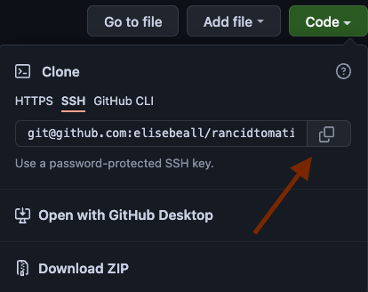

# Rancid Tomatillos

## How to Use the App:

- Clone down this repo to your computer

- Access the root folder in your Terminal
`cd ${location downloaded}/rancidtomatillos/`
- Type `npm install` to install all required dependencies
- Type `npm start` to start local server  
- Paste `http://localhost:8080/` into your web browser to view the application

## Preview:

## Primary Technologies Used:

- React
- Router
- CSS
- Cypress
- Webpack
- Fetch API

## Original Assignment:

- [Rancid Tomatillos](https://frontend.turing.edu/projects/module-3/rancid-tomatillos-v3.html)

## Contributors:

- [Anna Kummer](https://github.com/annamkummer)
- [Elise Beall](https://github.com/elisebeall)

## Team Wins:
- Learning Cypress stubs & acceptance testing
- Learning React & Router
- Practicing CSS

## Future Iterations:
- Refactor using React Hooks
- Refactor fetch calls with Async, Await & a custom hook
- Refactor filter method using Higher-Order Components
- Refactor user interface using responsive design & animations
